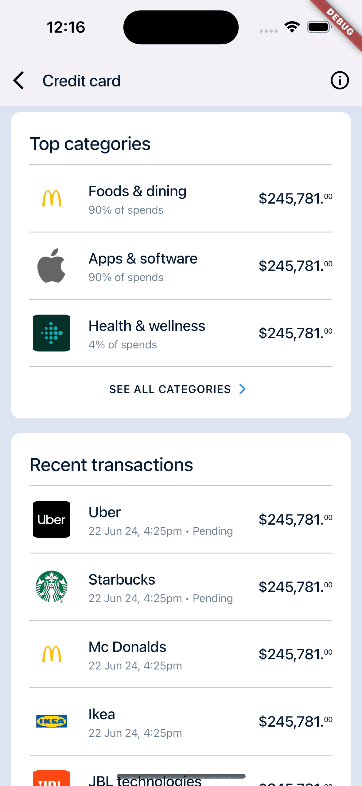

# finvest

A demo project to showcase the flutter Ui for a Fintech Application.

To run the project, you can follow these steps:

0. Make sure you have Flutter installed on your machine. If not, you can download and install it from the official Flutter website.

1. Run the following command to fetch the project dependencies:

   ```
   flutter pub get
   ```

2. Once the dependencies are fetched, you can run the project using the following command:
   ```
   flutter run
   ```

This will launch the application on a connected device or emulator.

Note: Make sure you have a device connected or an emulator running before executing the `flutter run` command.

| Image 1                                                                  | Image 2                                                                  |
| ------------------------------------------------------------------------ | ------------------------------------------------------------------------ |
|  |  |
| Image 3                                                                  | Image 4                                                                  |
|  |  |
| Image 5                                                                  | Image 6                                                                  |
|  |  |
